# Tether

> Stay tethered to where you work and to what you capture.

[](https://github.com/sohailmahmud/tether/actions/workflows/android-attendance.yml)
[](https://github.com/sohailmahmud/tether/actions/workflows/flutter-capture.yml)

Tether is my submission for the Intelligent Machines **Senior App Developer Technical Assessment**: two production-style mobile apps in one repository, one per task, built around the same principles of layered architecture, unidirectional state and verified behaviour.

| App | Task | Stack |
|---|---|---|
| **Tether Attendance** — [`android-attendance/`](android-attendance) | Task 1: geo-fenced attendance. Attendance can be marked only within 50 m of a saved office location. | Native Android · Kotlin · Jetpack Compose · Kotlin Flow |
| **Tether Capture** — [`flutter-capture/`](flutter-capture) | Task 2: custom camera with batch capture and a resilient, offline-first upload queue | Flutter · BLoC/Cubit · layered architecture |

The name reflects what both apps do: attendance is tethered to a 50 m radius around the office, and captured photos stay tethered to a local queue until the server confirms them.

<p align="center">
  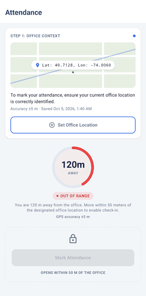
  &nbsp;
  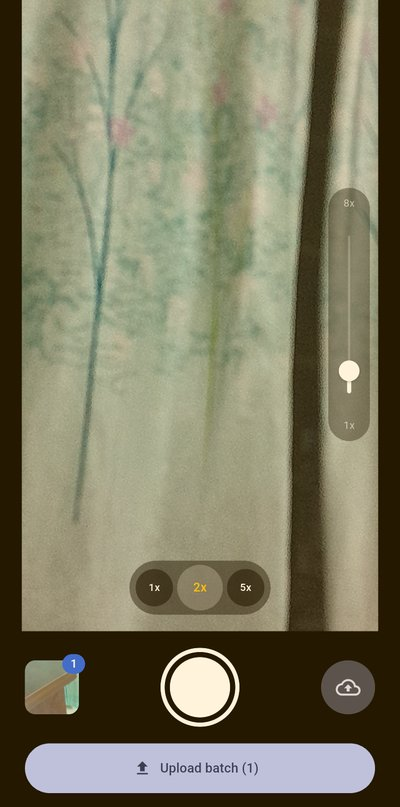
  &nbsp;
  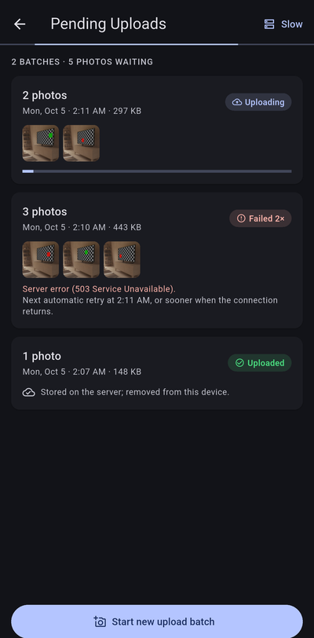
</p>

**Contents:** [Highlights](#highlights) · [Requirements](#requirements-traceability) · [Structure](#project-structure) · [Architecture](#architecture) · [BLoC/Cubit classes](#main-bloccubit-classes) · [Decisions](#key-engineering-decisions) · [Persistence](#local-persistence) · [Sync](#sync-strategy) · [Errors](#error-handling) · [Mock API](#mock-api) · [Testing](#testing-and-verification) · [AI usage](#generative-ai-usage) · [How to run](#how-to-run) · [Screenshots](#screenshots) · [Release APK](#release-apk) · [Limitations](#known-limitations)

## Highlights

- **One geofence rule, enforced twice.** Eligibility lives in a single domain function, `AttendancePolicy`, that combines distance, GPS accuracy and fix freshness. The UI uses it to enable the button, and `MarkAttendanceUseCase` re-validates it at the moment of the tap, so a stale screen can never record an invalid check-in.
- **Offline-first upload queue with exactly-once processing.** A transactional SQLite queue persists every batch and photo. An atomic claim prevents the app and the background worker from uploading the same batch, and photos are deleted only after the server has confirmed the upload.
- **Self-healing sync.** Uploads resume without user action:
  - In the foreground, when the connection returns and is stable.
  - In the background, through WorkManager with a network constraint and exponential backoff.
  - After a crash, uploads interrupted by process death are recovered.
- **Hardware-adaptive camera.** Zoom shortcuts (0.5x, 1x, 2x, …) are derived from the device's real zoom range. Tap-to-focus is mapped through the display orientation, and the camera is owned in a lifecycle-safe way.
- **Verified, not assumed.**
  - 216 automated tests (85 Android, 131 Flutter), from domain rules to Compose UI and full app flows.
  - Strict static analysis, and continuous integration on every push and pull request.
  - Release builds (R8-shrunk and AOT-compiled) verified on a physical device, including a background upload with the app killed.

## Requirements traceability

| From the brief | Implementation | Verified by |
|---|---|---|
| **Task 1:** "Set Office Location" fetches GPS coordinates and saves them locally | `SetOfficeLocationUseCase` takes a fresh high-accuracy fix (±50 m or better) and persists it in Preferences DataStore | Unit tests; device, including after a restart |
| Mark Attendance enabled only within 50 m | `AttendancePolicy.evaluate()`, re-checked by `MarkAttendanceUseCase` at the tap | Boundary tests (49.99 m in, 50.01 m out); emulator walk-in |
| Real-time distance indicator | Live fused-location updates → `StateFlow` → distance ring and "You are N m away" | Device; emulator walk-in |
| UI from the reference screenshot, in Jetpack Compose | `AttendanceScreen` | [Screenshots](#screenshots), taken at the reference's own coordinates |
| **Task 2:** custom `CameraPreviewScreen` | `CameraPreviewScreen` with `CameraCubit` | Widget tests; device |
| Pinch-to-zoom, slider and rounded buttons (0.5x, 1x, … per back camera) | Zoom levels derived at runtime from the back camera's zoom range | Unit and widget tests; device (1x, 2x, 5x on a 1x–8x camera) |
| Tap-to-focus with a visual indicator | Focus and exposure point at the tap, with an animated focus square | Device |
| Multiple batches and a "Pending Uploads" list | Persistent SQLite queue and `PendingUploadsScreen` | Real-SQL tests; device, including after a restart |
| Background worker that monitors connectivity | WorkManager task with a network-connected constraint | Device: with the app killed, Android started the process for the job and the upload completed |
| Low bandwidth or no internet: images stay in the local queue | A failed upload keeps its photos and records and is retried with backoff | Tests; device (slow connection, server error, airplane mode) |
| Automatic retry once a stable connection is detected | `SyncCubit` (connection stable for 3 s) and the background worker | Device; emulator recording |
| Mock API with success and failure responses | `MockUploadApi` behind the `UploadApi` contract, four modes | Tests; in-app mode selector |
| **General:** BLoC/Cubit, Kotlin Flow, layered architecture, local storage, graceful permission and hardware failures | [Architecture](#architecture), [Persistence](#local-persistence), [Error handling](#error-handling) | 216 automated tests, run in CI |
| **Deliverables:** source code, README, release APK link | This repository, this README, [Release APK](#release-apk) | Both apps build from a fresh clone; the signed APKs were installed and smoke-tested on a device |

## Project structure

```text
tether/
├── android-attendance/          Task 1: native Android app (Kotlin, Jetpack Compose)
│   └── app/src/main/java/com/tether/attendance/
│       ├── data/
│       │   ├── local/           office location and last check-in in Preferences DataStore
│       │   └── location/        device position from the fused location provider
│       ├── domain/              models, attendance rules, repository contracts, use cases
│       ├── presentation/        Compose UI, ViewModel, theme
│       └── di/                  manual dependency wiring
├── flutter-capture/             Task 2: Flutter app
│   └── lib/
│       ├── main.dart            composition root
│       ├── app/                 app shell, background worker entry point, sync wiring
│       ├── core/                shared utilities
│       ├── domain/              entities, repository contracts, the upload engine (pure Dart)
│       ├── data/                upload queue (SQLite + photo files), camera, mock API,
│       │                        connectivity, WorkManager scheduling
│       └── presentation/
│           ├── camera/          CameraPreviewScreen, CameraCubit, camera widgets
│           └── uploads/         PendingUploadsScreen, UploadQueueCubit, SyncCubit, MockServerCubit
└── docs/screenshots/            images used in this README
```

**Approach.**
- **Two independent apps,** one per task, each with its own build and release artifact.
- **The same layered shape in both:** presentation → domain → data.
- **Business rules in a framework-free domain layer:** the geofence in `AttendancePolicy`, the upload engine in `ProcessUploadQueue`.
- **One-way state.** On Android, a `StateFlow` in a ViewModel; on Flutter, one BLoC/Cubit per concern. Screens render state and dispatch user intents, nothing more.

## Architecture

### Tether Attendance: native Android with Kotlin Flow

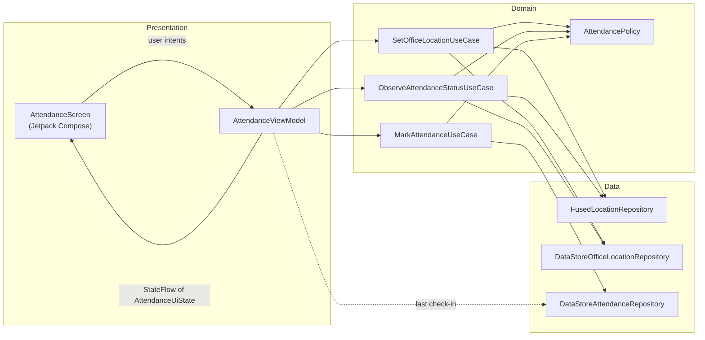

- **Presentation:**
  - `AttendanceScreen` is a stateless Compose screen that renders a single `AttendanceUiState`.
  - `AttendanceViewModel` owns that state.
  - `AttendanceRoute` handles the Android-specific edges the ViewModel must not touch: runtime permissions and system settings.
- **Domain:**
  - `SetOfficeLocationUseCase` takes a fresh fix and saves it if it meets the accuracy rule.
  - `ObserveAttendanceStatusUseCase` combines the saved office with live location into an `AttendanceStatus`: not set, locating, unavailable, or measured with distance and eligibility.
  - `MarkAttendanceUseCase` re-validates eligibility and fix freshness before recording.
- **Data:** Google Play services fused location and two Preferences DataStore repositories. Each data source has exactly one repository, so no pass-through layers are added.

**State management (Kotlin Flow).**
- **Single source of truth:** `uiState` is one `StateFlow`, built by `combine`-ing the attendance status, the last check-in from storage, and a small `MutableStateFlow` of in-flight actions and errors. Storage stays authoritative, so saving an office automatically restarts tracking against it.
- **Lifecycle-scoped tracking:** the state is shared with `SharingStarted.WhileSubscribed(5_000)` and collected with `collectAsStateWithLifecycle`. GPS runs only while the screen is visible, and survives a configuration change without restarting.

**Geofence rules (`AttendancePolicy`).**

| Rule | Value | Rationale |
|---|---|---|
| Geofence radius | 50 m, inclusive | Assessment brief |
| Distance | Haversine on a spherical Earth (under 0.3 m error at 50 m) | Accurate at this scale without a geodesy dependency |
| Minimum accuracy | ±50 m or better, to check in **and** to set the office | A fix less certain than the geofence can't tell inside from outside, and an imprecise office would shift the whole geofence |
| Maximum fix age | 15 s; older fixes show "No GPS signal" and are refused at check-in | Updates arrive every 2 s, so 15 s of silence means the signal is lost and the user may have moved |
| Displayed distance | Rounded **up** to whole metres | The label always agrees with the rule: 50.0 m shows "50m" (in range), 50.2 m shows "51m" (out) |

### Tether Capture: Flutter with BLoC/Cubit

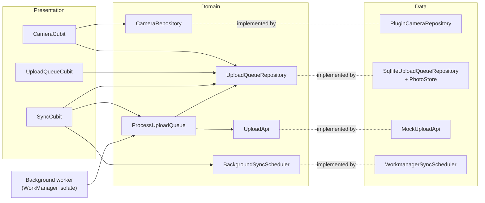

- **Domain** (no Flutter or plugin imports):
  - Camera capabilities, including the rule that picks the zoom buttons.
  - Upload queue entities and their status model.
  - The `ProcessUploadQueue` engine with its `RetryPolicy`.
  - The contracts the data layer implements.
- **Data:** the `camera` and `permission_handler` plugins, the SQLite queue and photo store, the mock API, connectivity (`connectivity_plus`) and WorkManager scheduling (`workmanager`).
- **Presentation:** two screens and four Cubits. Widgets hold no business logic. The demo-only `MockServerCubit` is left out of the diagram.
- **Composition root** (`main.dart`, `app/`):
  - Wires concrete implementations.
  - `SyncDependencies` builds the upload engine identically for the app and for the background worker isolate.
  - The presentation layer never imports the camera plugin, so widget tests run against a stand-in preview.

**Camera behaviour.**
- **Zoom adapts to the hardware.** A 0.5x button appears only when the back camera's minimum zoom is below 1x, which is how Android exposes an ultra-wide lens. Then come 1x, 2x, 5x and 10x where the camera reaches them, and pinch and the slider cover every level in between. On Android the plugin reports every lens type as "unknown", so the zoom range is the reliable signal.
- **Tap-to-focus** maps the tap to normalised preview coordinates, which the plugin projects onto the sensor using the display orientation. Exposure is metered at the same point. Fixed-focus cameras skip it.
- **Lifecycle-safe:** the camera is released when the app goes inactive or another screen covers it, and is restored with the same zoom. The pause caused by the permission dialog itself is ignored.
- **Serialized hardware access:** open, release and capture run strictly in order, so the camera is never released mid-capture. Repeated shutter taps are ignored.
- **1080p JPEGs:** sharp enough for documentation while keeping uploads small on slow networks.

### Main BLoC/Cubit classes

| Class | Responsibility |
|---|---|
| `CameraCubit` | Owns the camera lifecycle and controls: permission, open and release, zoom, tap-to-focus, and capture into the upload queue. It exposes a sealed `CameraState`: Starting, PermissionRequired, Unavailable, Paused or Ready. |
| `UploadQueueCubit` | Streams the persistent queue to the UI (the batch being captured and the submitted batches), and submits the current batch when the user taps **Upload batch**. |
| `SyncCubit` | Decides when uploads run while the app is open: on launch, on a stable reconnection, when a retry falls due, and on user request. It keeps a background run scheduled while work remains and exposes connectivity for the offline banner. |
| `MockServerCubit` | Holds the simulated server mode, so every success and failure path can be demonstrated without a backend. |

## Key engineering decisions

| Decision | Alternatives considered | Rationale |
|---|---|---|
| `StateFlow` + ViewModel, manual DI (`AppContainer`) | Hilt, Koin | One screen and three repositories don't justify a DI framework. Explicit wiring stays readable and testable. |
| Preferences DataStore for the office and last check-in | SharedPreferences, Room | Asynchronous, transactional and Flow-native. Two small records don't need a relational schema. |
| SQLite (`sqflite`) for the upload queue | Hive, Isar, Drift | Transactions and safe multi-isolate access are required for exactly-once claims. Hive offers neither, Isar's long-term maintenance is uncertain, and Drift adds code generation for a two-table schema. |
| Photos moved out of the cache, stored by relative path | Keep in cache; absolute paths | Android may clear the cache at any time. Relative paths survive a change of storage location. |
| One-off unique WorkManager task with a network constraint, plus foreground triggers | Periodic work only; foreground only | Periodic work has a 15-minute floor. A constrained one-off task runs as soon as a network is available, backoff paces retries, and foreground triggers react instantly while the app is open. |
| Mock API behind the `UploadApi` contract, with selectable failure modes | Commented-out API code | Exercises every failure path end to end. A real HTTP client replaces one data-layer class. |
| Two apps, two APKs | One native app embedding Flutter | The brief doesn't require integration. Embedding would add build and runtime risk without improving either task. |

## Local persistence

**Tether Attendance:** Preferences DataStore, with two independent stores.
- `office_location`: latitude, longitude, fix accuracy and save time, written in a single transaction so a read never mixes old and new values. A missing, partial or out-of-range record reads as "no office set".
- `attendance`: the most recent check-in (time, distance and accuracy).

**Tether Capture:** an SQLite upload queue.
- `upload_batches`: status, retry count, last error, next attempt time, and created, submitted and updated timestamps.
- `upload_items`: one row per photo, with its file path, size, status and capture time.

**Integrity in the schema:**
- Foreign keys from photos to batches, enabled on every connection.
- `CHECK` constraints on status values.
- A partial unique index that allows exactly one draft batch.
- Migrations run in place (schema v1 → v2 was verified on a device with a populated queue).

**Batch flow:**
- Photos go into the open *draft* batch.
- **Upload batch** turns it into a *pending* batch and the next photo starts a new draft, so any number of batches can wait in the queue.
- The draft is an addition to the master plan's four upload statuses: the batch still being captured, which is never uploaded.

**Photo files:**
- Each capture is atomically moved from the cache into app storage under `photos/<batch>/<photo>.jpg`.
- If recording it fails, the file is removed.
- Files orphaned by a process kill at an unlucky moment are swept at the next launch.

**Backup and device transfer** are disabled in both apps:
- A restored office location could be edited to move the geofence.
- A restored queue would no longer match the server.

## Sync strategy

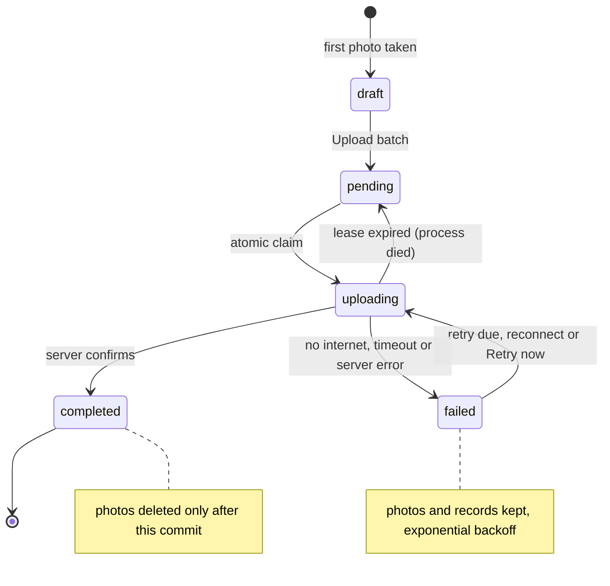

`ProcessUploadQueue`, the upload engine, runs the same four steps wherever it is triggered:

1. **Recover:** a batch left *uploading* for longer than its 5-minute lease (the process died mid-upload) returns to *pending*.
2. **Claim:** the oldest due batch is marked *uploading* inside one exclusive SQLite transaction, with an update conditional on the status just read.
   - On Android, sqflite shares one native connection between the app and the background isolate and serializes their transactions.
   - The claim is therefore exactly-once across both. This was confirmed in the plugin source and covered by a concurrent-claim test.
3. **Upload** through `UploadApi`, with the batch id as the idempotency key.
4. **Record the outcome:**
   - **Success:** the batch is completed, then its files are deleted.
   - **Failure:** photos and records are kept, the attempt is counted, and a retry is scheduled (30 s, doubling, capped at 15 min).
   - **No connection:** the run stops early, since every remaining batch would fail the same way.

**Guarantees, each covered by tests:**
- **No data loss.** Files are deleted only after completion is committed.
- **No duplicate processing.** Claims are atomic, and a late failure from an attempt that outlived its lease can't overwrite a completed batch.
- **Restart safety.** Interrupted uploads are recovered by the lease.
- **Bounded retries.** Backoff limits how often a failing server is retried, and an unexpected storage error waits at least 30 s rather than spinning.

**Triggers, with no user action needed:**

| Trigger | Mechanism |
|---|---|
| App launch | Foreground run for anything left over |
| Connection returns and stays up for 3 s | `connectivity_plus` in `SyncCubit`. Failed batches retry at once, and the stability window keeps a flapping network from triggering failing attempts |
| A failed batch's retry time arrives | Foreground timer, paused while offline |
| App in the background or closed | **WorkManager** worker |

**Upload batch** and **Retry now** also start a run; they are conveniences, not the retry mechanism.

**Background worker:**
- While any batch is unfinished, one unique one-off WorkManager task is kept scheduled, with a *network connected* constraint and exponential backoff.
- WorkManager runs it in a separate isolate, even after the app is closed.
- The worker builds the same engine as the app and asks to be retried until the queue is empty.

**Cross-isolate consistency:**
- The worker's writes are announced to the app's isolate over `IsolateNameServer` (`QueueChangeChannel`), so an open Pending Uploads screen updates the moment the background worker finishes.
- The worker never closes the shared database connection.

## Error handling

**Tether Attendance:** live-tracking problems appear in the distance section, with Mark Attendance locked.

| Situation | Shown |
|---|---|
| No location permission | **Permission needed**, with **Allow location** |
| Location services off | **Location off**, with **Turn on location** |
| No fix for 15 s | **No GPS signal**, with guidance to move near a window or outdoors |
| Fix worse than ±50 m | **Weak GPS signal** with the current accuracy |

Failed user actions raise a banner that offers the fix where one exists:

| Situation | Banner |
|---|---|
| Permission denied | Explanation; asking again shows the system dialog |
| Permanently denied | Explanation with **Open settings** |
| Only approximate location granted | Precise location is required for a 50 m check, with **Open settings** |
| Location services off | **Turn on**, which opens location settings |
| No fix within 30 s while setting the office | Guidance to retry with a clearer view of the sky |
| Office fix worse than ±50 m | Not saved, with guidance to improve the signal |
| The user moved, or the fix went stale, between render and tap | Check-in refused; re-check the distance |
| Storage write fails | Retry message; previous data is kept |

When the user returns from Settings with the cause fixed, the banner clears and tracking restarts automatically. Replacing an existing office asks for confirmation, because it moves the geofence.

**Tether Capture:**

| Situation | Shown |
|---|---|
| Camera permission denied, or denied permanently | **Allow camera**, or **Open settings**. The camera opens automatically on return |
| No back camera, or the camera fails to start | A clear message, with **Try again** where retrying can help |
| A capture fails, or the photo can't be saved to the queue | A snackbar; the camera stays ready and nothing half-saved remains |
| Storage can't be opened at launch (e.g. the device is full) | A dedicated "Can't open storage" screen instead of a blank app |
| Offline | A banner: uploads resume automatically when the connection returns |
| An upload fails (no internet, timeout, server error) | "Failed once" (or "Failed N×") with the error and the next retry time. Photos stay on the device, and **Retry now** is offered |
| An upload is interrupted by the process dying | The batch returns to the queue with a note, and is retried |

Only the camera permission is requested. Permissions that plugins declare but the app doesn't use are removed from the merged manifest: the camera plugin's microphone and storage permissions, and the workmanager plugin's notification permission.

## Mock API

The brief provides no backend. `MockUploadApi` implements the `UploadApi` contract in the data layer, so replacing it with a real HTTP client changes nothing above that layer.

- **Real connectivity:** with no network (e.g. airplane mode) every upload fails with "No internet connection", whatever the mode.
- **Idempotent:** re-sending a stored batch returns its original receipt, which is the contract a real server must honour for the batch-id key.
- **Modes**, selected under **Mock server** on Pending Uploads and shared with the background worker through a small settings file:

| Mode | Behaviour |
|---|---|
| Normal | Succeeds after a transfer time based on batch size (about 2 MB/s, at least 0.5 s) |
| Slow connection | About 16 KB/s, so a typical photo batch times out after 8 s |
| Server error | Fails with 503 Service Unavailable |
| Unstable connection | About half of the uploads drop part-way |

## Testing and verification

**Automated tests: 216.**

| App | Layer | Tests | What they prove |
|---|---|---|---|
| Android | Domain | 33 | Geofence boundary, accuracy and freshness rules, distance maths, use-case outcomes |
| Android | Persistence | 14 | Record encoding, and the DataStore repositories on real files: restart survival, and corrupt or partial data reads as "not set" |
| Android | Presentation | 26 | ViewModel state transitions: permissions, errors, double taps, stale fixes, lifecycle |
| Android | Compose UI | 12 | `AttendanceScreen` on the JVM through Robolectric: each state's text, button enablement, the replace-office confirmation, and every action a tap reports |
| Flutter | Domain | 17 | Upload engine outcomes, retry policy, zoom-level selection |
| Flutter | Data | 36 | Real SQL through `sqflite_common_ffi`, including concurrent claims, restart survival, schema upgrade and orphan cleanup, plus every mock API mode |
| Flutter | BLoC/Cubit | 41 | Camera lifecycle, capture concurrency, sync triggers and timing, queue streaming |
| Flutter | Widgets and app wiring | 32 | Screens, the background run result, cross-isolate notifications, the startup failure screen |
| Flutter | App flows | 5 | The real `TetherCaptureApp` end to end, with fakes only for the camera and network: capture → upload → uploaded; offline → queued → automatic upload once the connection is stable; server error → automatic retry after backoff; Retry now; separate batches |

**Techniques:**
- **Virtual time** (`fake_async`) for retry timers and connection-stability windows.
- **`bloc_test`** for state sequences.
- **Mutation checks** on critical guarantees. Each one disables the code under test and confirms the suite fails:

  | Code disabled | Result |
  |---|---|
  | Atomic claim | The concurrency test fails with 12 claims for 6 batches |
  | Late-failure guard | A completed batch regresses to failed |
  | Locked Mark Attendance button | Five UI tests fail |
  | Reconnect retry | The offline flow test fails |
- **Coverage:** Tether Capture's suite covers 94% of lines (`flutter test --coverage`).

**Continuous integration** (GitHub Actions). Each app has its own workflow, triggered by changes to that app on pushes to `main` and on pull requests:

| Workflow | Steps |
|---|---|
| [Android · Tether Attendance](.github/workflows/android-attendance.yml) | <ol><li>ktlint</li><li>Android Lint</li><li>unit and Compose UI tests</li><li>debug and R8 release builds</li></ol>Test reports and the debug APK are uploaded as artifacts. |
| [Flutter · Tether Capture](.github/workflows/flutter-capture.yml) | <ol><li>formatting</li><li>`flutter analyze`</li><li>all tests with coverage</li><li>a release APK build</li></ol>The coverage summary and the APK are uploaded. |

CI has no signing secrets, so its release builds fall back to the debug key. Signed APKs are built locally (see [How to run](#how-to-run)).

**Static analysis:**
- **Android:** ktlint and Android Lint, with 0 issues.
- **Flutter:** strict analyzer settings (`strict-casts`, `strict-inference`, `strict-raw-types`), and unawaited futures are errors.

**Device verification:** Samsung Galaxy A04s, Android 14. Evidence came from screenshots, logcat, and Android's JobScheduler and location dumps.

| Scenario | Result |
|---|---|
| Geofence at the boundary | With an office 50 m away, GPS jitter switched the screen between "50 m, In range" and "51 m, Out of range" |
| Location lifecycle | Location requests stopped within seconds of leaving the app and resumed on return |
| Restart persistence | The office location and the upload queue survived force-stop and relaunch; the queue also survived an in-place schema upgrade |
| Background upload, app killed (release build) | When the backoff ended, Android started the process for the WorkManager job, and the worker uploaded the batch with no UI |
| Offline → online | A batch failed in airplane mode and uploaded about 11 s after reconnecting, with no tap |
| Low bandwidth | A batch timed out in slow-connection mode, kept its photos, and later uploaded automatically |
| App and worker concurrently | Overlapping runs never processed the same batch twice |
| Final signed APKs, fresh install | Permission prompts appeared on first launch. The office was saved from a ±34 m fix and a check-in was recorded. A ±70 m fix locked check-in until accuracy recovered. A 3-photo batch was captured and uploaded |

## Generative AI usage

I used generative AI as an engineering accelerator in two distinct roles, while keeping ownership of requirements, architecture and verification.

| Stage | Tool | Role |
|---|---|---|
| Planning | **ChatGPT** | Turned the assessment PDF into a master execution plan for a senior mobile engineer. It defines: <ul><li>the role and priorities</li><li>the PDF as the single source of truth</li><li>ten time-boxed phases with milestone gates</li><li>a requirements traceability matrix with an ID and verification method for every requirement</li><li>platform architecture guidance</li><li>test matrices, a quality bar and git discipline</li><li>a standard report for every phase</li></ul> |
| Execution | **Claude Code** | Executed the plan phase by phase in this repository: <ul><li>inspected the code and implemented the phase on a feature branch</li><li>ran formatting, static analysis and tests</li><li>deployed builds to a physical device over adb and collected evidence</li><li>reported each phase against the traceability matrix</li></ul> |

**Engineering workflow:**
1. **Plan:** the master prompt fixed scope, priorities and acceptance criteria before any code was written.
2. **Execute:** each phase was implemented in isolation, then stopped for review with a report of what changed, evidence, requirement status and a proposed commit.
3. **Review and decide:** I reviewed every phase before it was committed and merged through a pull request. I made the architectural and delivery decisions:
   - the storage engine for the queue
   - the branching strategy
   - release packaging
   - keeping real location data out of published screenshots
4. **Verify:** AI output was treated as a proposal until proven:
   - by automated tests and mutation checks
   - by reading library source before relying on undocumented behaviour (sqflite's shared connection between isolates)
   - by device evidence

**Where verification changed the outcome:**
- **Cross-isolate state:** device testing showed that a batch uploaded by the background worker still appeared as failed on an open screen. Fixed with an `IsolateNameServer` change channel.
- **Indoor GPS:** transient "location unavailable" callbacks produced false "No GPS signal" states. Replaced with freshness-based detection, where a fix older than 15 s counts as lost.
- **Hardening review:**
  - A late failure could revert a completed batch.
  - A persistent storage fault could cause a busy retry loop.
  - An imprecise fix could be saved as the office.

  All three were fixed with regression tests.

### Essential prompts

**1. Master execution prompt** (prepared with ChatGPT and used as the standing instruction set in Claude Code). Representative excerpts, verbatim:

> You are my senior software engineering assistant for the Intelligent Machines Ltd. Senior App Developer Technical Assessment. […] Your role is to help me design, implement, review, debug, test, and document each phase while keeping the project technically consistent from beginning to end.

> Treat the provided Intelligent Machines assessment PDF as the authoritative source for explicit requirements. Do not silently invent additional mandatory requirements.

> Work on ONE phase at a time. […] Run relevant formatting, static analysis, tests, and build checks. Review for regressions. Update requirement statuses based only on actual verification.

> Prevent: duplicate worker processing, conflicting state transitions, deletion before success, duplicate retry processing. Prefer idempotent processing behavior.

> Do not mark a requirement as DONE merely because code exists.

**2. Phase execution prompts.** Because the master prompt defined each phase's scope, checks and report format, each phase was started with a one-line instruction such as `start Phase 6`. After review, the next one began with `commit, merge and start Phase 7`.

**3. Architecture and verification requests** (summarised):
- Evaluate SQLite against Hive and other options (Isar, Drift) for a queue shared with a background isolate. *Outcome:* SQLite, for transactions and multi-isolate safety.
- Recommend an enterprise branching strategy and repository visibility. *Outcome:* a feature branch and pull request per phase, with the repository kept private until submission.
- Re-run background synchronization on the physical device after a manual airplane-mode test. *Outcome:* the cross-isolate stale-state defect was found and fixed.

## How to run

**Prerequisites:**
- JDK 17+, Android SDK 37 and Flutter 3.44.x (stable).
- The Android SDK location, either in `ANDROID_HOME` or in a `local.properties` that Android Studio writes the first time it opens the project.
- An Android device or emulator. A physical device is recommended for GPS and camera.

```bash
git clone https://github.com/sohailmahmud/tether.git
cd tether
```

**Tether Attendance:**

```bash
cd android-attendance
./gradlew installDebug
```

Alternatively, open `android-attendance/` in Android Studio and run the `app` configuration.

**Tether Capture:**

```bash
cd flutter-capture
flutter pub get
flutter run
```

**Trying it out:**

- **Attendance:**
  - Tap **Set Office Location** and allow precise location; the ring shows 0 m.
  - Move more than 50 m away and Mark Attendance locks.
  - On an emulator, simulate movement instead (longitude first):

    ```bash
    adb emu geo fix -74.0060 40.7128     # set the office here
    adb emu geo fix -74.0060 40.7138791  # about 120 m north: Out of range
    ```

- **Capture:**
  - Take a few photos and tap **Upload batch**.
  - On **Pending Uploads**, use **Mock server** to switch between Normal, Slow connection, Server error and Unstable connection.
  - To see automatic recovery, enable airplane mode, upload a batch, then disable it.
    - With the app open, the batch uploads a few seconds later.
    - With the app closed, the background worker uploads it once the network is back and its backoff has passed.

**Release builds:**

```bash
cd android-attendance && ./gradlew assembleRelease    # app/build/outputs/apk/release/
cd flutter-capture && flutter build apk --release     # build/app/outputs/flutter-apk/
```

Release signing reads `android-attendance/keystore.properties` and `flutter-capture/android/key.properties`. Both are git-ignored; see the `.example` files next to them. Without them, release builds are signed with the debug key, so a fresh clone still produces installable APKs.

**Quality checks:**

```bash
# Android: formatting, lint, unit and Compose UI tests (85)
cd android-attendance && ./gradlew ktlintCheck lintDebug testDebugUnitTest

# Flutter: formatting, static analysis, unit, widget and app-flow tests (131)
cd flutter-capture && dart format --set-exit-if-changed lib test && flutter analyze && flutter test
```

**Toolchain:**

| | Version |
|---|---|
| Flutter / Dart | 3.44.6 (stable) / 3.12.2 |
| Android Gradle Plugin | 9.1.1 (built-in Kotlin) |
| Kotlin | 2.3.20 |
| Gradle | 9.3.1 (wrapper, checksum-pinned) |
| compileSdk / targetSdk | 37 / 36 |
| minSdk | 26 (Android) · 24 (Flutter) |
| JDK | 17 or newer |

## Screenshots

**Sources:**
- **Attendance screens:** an emulator with a simulated location, placed at the reference screenshot's coordinates.
- **Queue screens:** the emulator's virtual camera scene.
- **Zoom and focus:** a physical device, because the emulator camera supports neither.

**Tether Attendance**

| Office not set | 120 m away, out of range | In range, attendance marked |
|---|---|---|
| 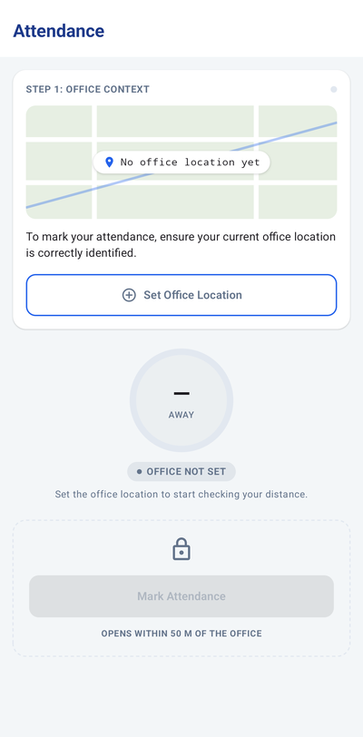 | 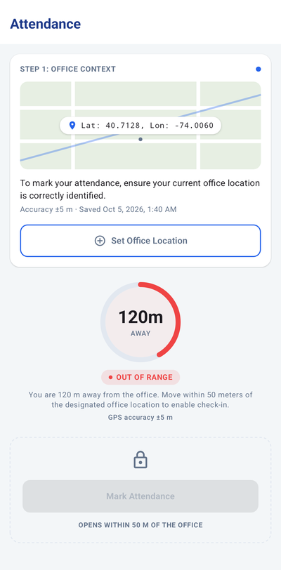 | 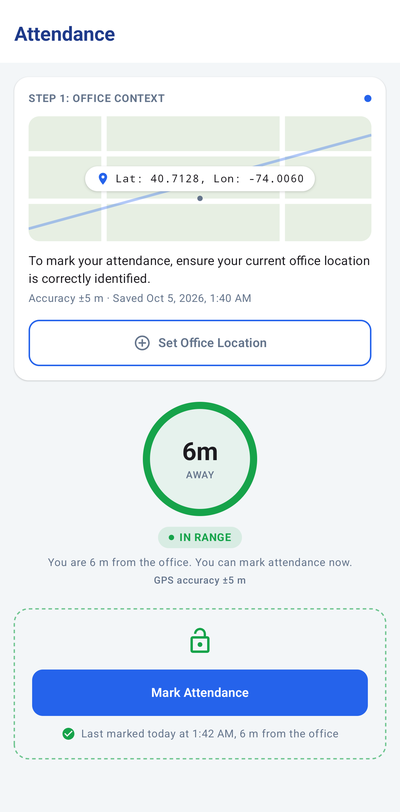 |

| Live distance (walking in from 120 m) | Dark theme | Location services off |
|---|---|---|
|  | 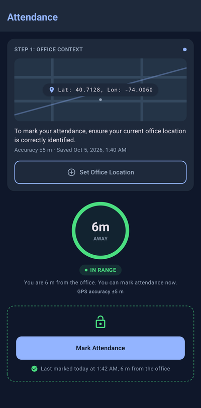 | 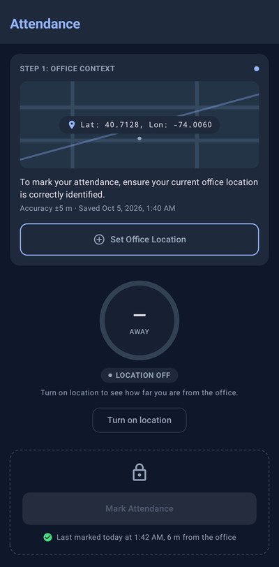 |

**Tether Capture**

| Hardware zoom (1x–8x camera) | Tap-to-focus | Batch being captured |
|---|---|---|
|  | 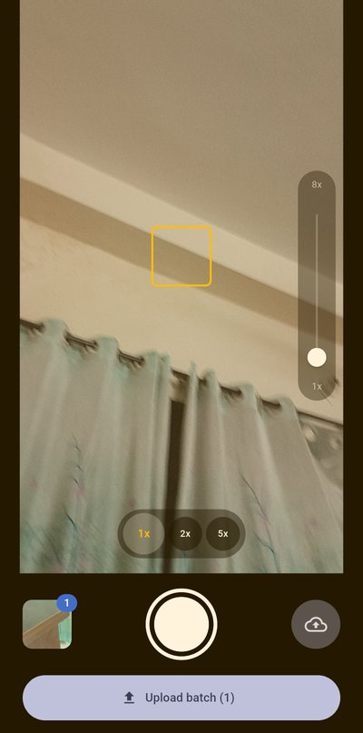 | 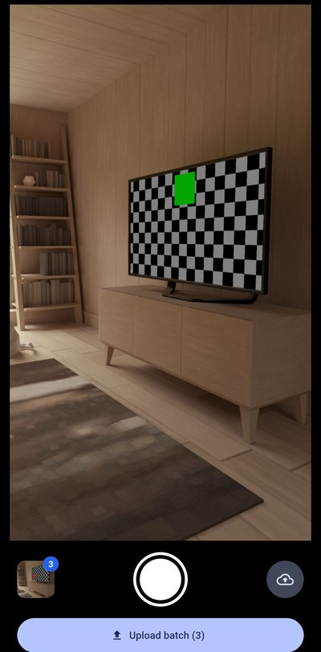 |

| Uploading, failed and uploaded | Offline | Reconnected: recovers by itself |
|---|---|---|
|  | 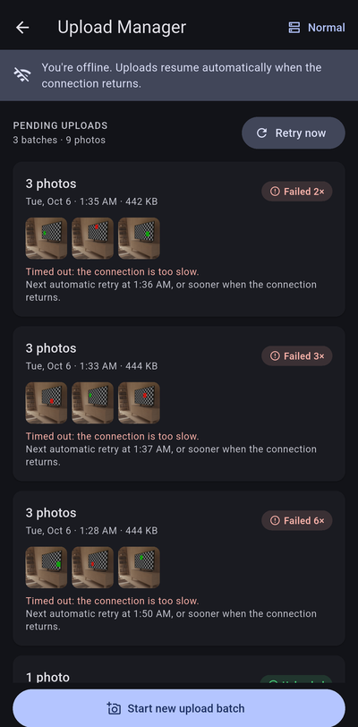 | 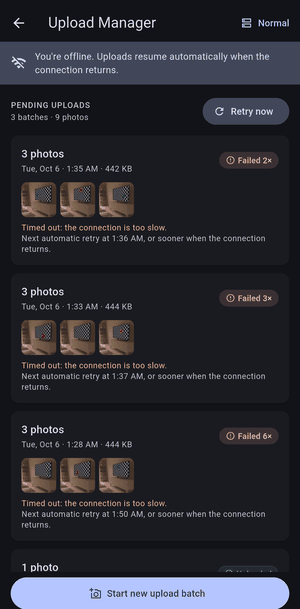 |

| Mock server modes |
|---|
| 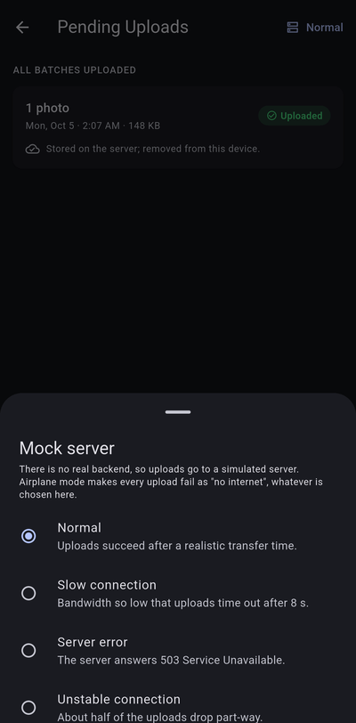 |

## Release APK

| App | Download | Size | Runs on |
|---|---|---|---|
| Tether Attendance 1.0.0 | [tether-attendance-v1.0.0.apk](https://github.com/sohailmahmud/tether/releases/download/v1.0.0/tether-attendance-v1.0.0.apk) | 1.4 MB | Android 8.0+ (API 26) with Google Play services |
| Tether Capture 1.0.0 | [tether-capture-v1.0.0.apk](https://github.com/sohailmahmud/tether/releases/download/v1.0.0/tether-capture-v1.0.0.apk) | 50 MB | Android 7.0+ (API 24) |

The [v1.0.0 release page](https://github.com/sohailmahmud/tether/releases/tag/v1.0.0) has both APKs and their SHA-256 checksums.

- **Signing:** both APKs are signed with the same release certificate (`CN=Sohail Mahmud, O=Tether`, SHA-256 `ee206ca23f0d2de83af4d4c9dfba2c5b96f4f2c612c716935e1395893247187f`).
- **Build:**
  - Tether Attendance is R8-shrunk.
  - Tether Capture is a universal APK (arm64-v8a, armeabi-v7a, x86_64) so it installs on any device, which accounts for its size.
- **Install:** open the APK on the device and allow installs from that source when Android asks.

**Packaging decision.** The two tasks are delivered as two apps, so there are two APKs. Combining them would mean embedding Flutter in the native app: integration the brief doesn't ask for, and risk that adds nothing to either task.

## Known limitations

**Tether Attendance**

- **Deviations from the reference UI:**
  - The map is a drawn placeholder, since a map SDK needs an API key the brief doesn't provide.
  - The "Available 09:00 AM – 10:30 AM" check-in window is not implemented, because the brief doesn't require it.
  - There is no back arrow, since this is the app's only screen.
- **Not covered:** mock (spoofed) locations aren't detected, and any user can set the office. In production that would be an administrator action, enforced on a server.
- **Local only:** only the most recent check-in is stored, with no history or server sync.

**Tether Capture**

- **Connectivity:** "online" means a network connection, not proven internet reachability. Behind a captive portal, uploads fail and back off until the network really works.
- **Background execution:** Android may defer background work (Doze, battery saver, vendor battery managers). While the app is closed, retries follow WorkManager's backoff, which can grow to its 5-hour cap if the server keeps failing; with the app open they are capped at 15 minutes.
- **Mock server state:** the mock keeps its idempotency record in memory, separately in each isolate, and loses it on restart. A real server persists it.
- **Camera scope:** portrait only, with no flash or front camera (the brief asks for back-camera zoom and focus). An ultra-wide lens that Android exposes only as a separate camera, rather than through zoom below 1x, gets no 0.5x button.
- **Uploads:** there is no per-batch progress percentage, and individual photos can't be removed from a batch before upload.
